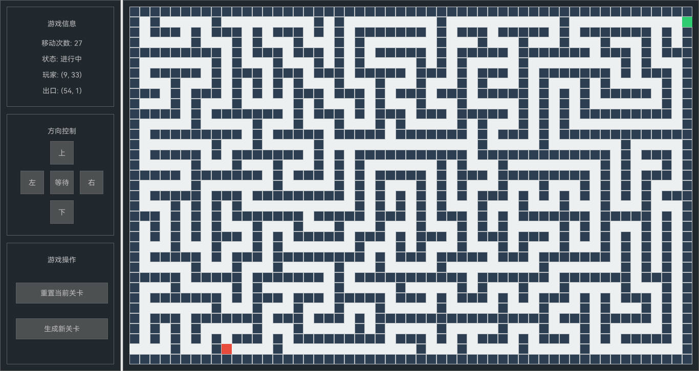
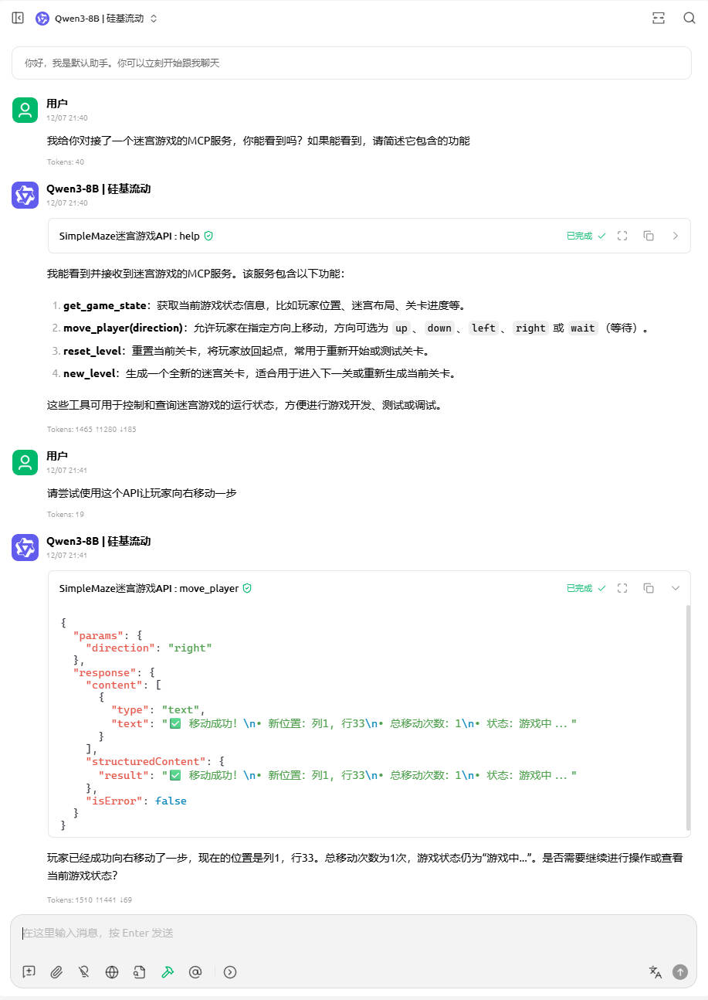

<div align="center">

<h1>简易迷宫AI游戏</h1>


</div>

---

# 一、🎮 项目概述

一个基于Python的迷宫游戏，集成了本地GUI界面、HTTP API服务和MCP（Model Context Protocol）服务，支持多种交互方式控制游戏进程。项目采用模块化设计，实现了游戏逻辑、UI展示、API服务和MCP服务的清晰分离。

> 🚨 重要说明
> 
> 整个项目几乎99%的代码和文档都是基于AI生成的哦！ 🤖 由DeepSeek AI模型（DeepSeek-V3.2）协助开发完成，展示了AI在软件开发中的强大能力。

# 二、🚀 快速开始

## 2.1  环境要求

- Python 3.7+
- 依赖包：参见 requirements.txt

## 2.2  安装步骤

```bash
# 克隆项目
git clone <repository-url>
cd maze_game

# 创建虚拟环境
python -m venv .venv

# 激活虚拟环境
# Windows:
.venv\Scripts\activate
# Linux/Mac:
source .venv/bin/activate

# 安装依赖
pip install -r requirements.txt
```

## 2.3  运行游戏

```bash
python python/main.py
```

启动后，游戏窗口将自动打开，同时：

- HTTP API服务将在 http://127.0.0.1:8080 启动
- MCP SSE服务将在 http://127.0.0.1:8000 启动

# 三、📁 项目结构

```text
SimpleMaze/
├── python/                           # 主要源代码目录
│   ├── main.py                       # 程序入口
│   ├── constants.py                  # 常量配置
│   ├── logger.py                     # 日志配置
│   ├── app/                          # 应用层
│   │   ├── ApplicationController.py
│   │   └── GameEventBus.py
│   ├── core/                         # 核心游戏逻辑
│   │   ├── models/                   # 数据模型
│   │   │   ├── GameModels.py
│   │   │   └── MazeModels.py
│   │   ├── game/                     # 游戏服务
│   │   │   └── MazeGameService.py
│   │   ├── maze/                     # 迷宫生成
│   │   │   └── MazeGenerator.py
│   ├── ui/                           # 用户界面
│   │   ├── GameWindow.py             # 主窗口
│   │   ├── MazeRenderer.py           # 迷宫渲染器
│   │   └── components/               # UI组件
│   │       ├── GameInfoPanel.py
│   │       ├── ControlPanel.py
│   │       ├── FunctionPanel.py
│   │       └── MazePanel.py
│   ├── server/                       # 服务器
│   │   ├── HttpGameServer.py         # HTTP服务器
│   │   └── McpGameServer.py          # MCP服务器
│   └── utils/                        # 工具类
│       └── FontManager.py
├── resources/                        # 资源文件
│   ├── HarmonyOS_SansSC_Regular.ttf  # 中文字体
│   ├── LICENSE.txt                   # 中文字体许可证
│   └── doc_imgs                      # 文档图片
│       ├── game_ui.jpg
│       └── mcp_client_demo.jpg
├── .gitignore
├── requirements.txt                  # 项目依赖
├── README.md                         # 项目说明
└── LICENSE                           # 许可证
```

# 四、🎯 游戏特性

## 4.1  三种控制方式

1. 本地GUI界面：可视化操作，支持按钮和键盘控制
2. 键盘快捷键：
   - 方向键/WASD：控制移动
   - 空格键：等待
   - R键：重置当前关卡
   - N键：生成新关卡
3. HTTP API：支持程序化控制，便于AI集成
4. MCP协议：通过标准MCP协议供AI自然语言调用

## 4.2  游戏机制

- 随机生成迷宫（55×35大小）
- 玩家从左下角出发，目标到达右上角出口
- 实时显示移动次数和位置信息
- 到达终点时显示胜利界面

# 五、🌐 HTTP API接口

## 5.1  基础信息

- 服务器地址：http://127.0.0.1:8080
- 请求格式：JSON
- 响应格式：JSON

## 5.2  可用接口

```text
GET    /api/health     # 健康检查
GET    /api/state      # 获取游戏状态
POST   /api/move       # 移动玩家
POST   /api/reset      # 重置当前关卡
POST   /api/new-level  # 生成新关卡
```

## 5.3  游戏状态数据结构

```json
{
  "maze_size": {"width": 55, "height": 35},
  "player_position": {"col": 1, "row": 33},
  "exit_position": {"col": 53, "row": 1},
  "move_count": 0,
  "is_completed": false
}
```

## 5.4  移动方向

- `up`：向上移动
- `down`：向下移动
- `left`：向左移动
- `right`：向右移动
- `wait`：等待（不移动）

## 5.5  API调用示例

```python
import requests

# 移动玩家
response = requests.post(
    "http://127.0.0.1:8080/api/move",
    json={"direction": "up"}
)

# 获取游戏状态
state = requests.get("http://127.0.0.1:8080/api/state").json()

# 重置关卡
requests.post("http://127.0.0.1:8080/api/reset")
```

# 六、🤖 MCP (Model Context Protocol) 服务

## 6.1  MCP服务器信息

- 服务器地址：http://127.0.0.1:8000
- 协议：SSE (Server-Sent Events)
- 框架：fastmcp

## 6.2  MCP端点

```text
GET    /sse           # SSE事件流
POST   /tools/call    # 调用MCP工具
GET    /tools         # 获取工具列表
```

## 6.3  可用MCP工具

### 6.3.1  get_game_state

**描述**：获取当前游戏状态信息

**使用示例**：

```json
{
  "jsonrpc": "2.0",
  "id": 1,
  "method": "tools/call",
  "params": {
    "name": "get_game_state",
    "arguments": {}
  }
}
```

### 6.3.2  move_player

**描述**：移动玩家到指定方向

**参数**：

- direction：移动方向，可选值：up(上), down(下), left(左), right(右), wait(等待)

**使用示例**：

```json
{
  "jsonrpc": "2.0",
  "id": 2,
  "method": "tools/call",
  "params": {
    "name": "move_player",
    "arguments": {"direction": "up"}
  }
}
```

### 6.3.3  reset_level

**描述**：重置当前关卡，将玩家放回起点

**使用示例**：

```json
{
  "jsonrpc": "2.0",
  "id": 3,
  "method": "tools/call",
  "params": {
    "name": "reset_level",
    "arguments": {}
  }
}
```

### 6.3.4  new_level

**描述**：生成全新迷宫关卡

**使用示例**：

```json
{
  "jsonrpc": "2.0",
  "id": 4,
  "method": "tools/call",
  "params": {
    "name": "new_level",
    "arguments": {}
  }
}
```

## 6.4  AI集成配置（示例）

### 6.4.1  CherryStudio 配置

在 CherryStudio 配置文件中添加：

```json
{
  "mcpServers": {
    "maze_game": {
      "name": "SimpleMaze迷宫游戏API",
      "description": "",
      "baseUrl": "http://localhost:8000/sse",
      "command": "python",
      "args": [
        "python/server/mcp/McpServer.py"
      ],
      "env": {},
      "isActive": true,
      "type": "sse",
      "longRunning": true,
      "provider": "Powerinv",
      "providerUrl": "https://github.com/PowerinvGames/SimpleMaze",
      "logoUrl": "",
      "tags": [
        "游戏"
      ]
    }
  }
}
```


### 6.4.2  其他MCP客户端

任何支持MCP协议的客户端都可以通过以下方式连接：

- SSE端点：http://127.0.0.1:8000/sse
- 工具调用端点：http://127.0.0.1:8000/tools/call

## 6.5  MCP使用示例

### 6.5.1  Python客户端示例

```python
import requests
import json

# 调用MCP工具
def call_mcp_tool(tool_name, arguments=None):
    url = "http://127.0.0.1:8000/tools/call"
    payload = {
        "jsonrpc": "2.0",
        "id": 1,
        "method": "tools/call",
        "params": {
            "name": tool_name,
            "arguments": arguments or {}
        }
    }
    
    response = requests.post(url, json=payload)
    return response.json()

# 获取游戏状态
result = call_mcp_tool("get_game_state")
print(result)

# 移动玩家
result = call_mcp_tool("move_player", {"direction": "right"})
print(result)

# 重置关卡
result = call_mcp_tool("reset_level")
print(result)

# 生成新关卡
result = call_mcp_tool("new_level")
print(result)
```

### 6.5.2  AI自然语言调用示例

AI可以直接使用自然语言调用工具，例如：

```text
用户：告诉我当前游戏状态
AI：调用 get_game_state() 工具

用户：让玩家向右移动
AI：调用 move_player({"direction": "right"}) 工具

用户：重新开始这一关
AI：调用 reset_level() 工具

用户：生成一个新的迷宫
AI：调用 new_level() 工具
```



# 七、🛠️ 开发说明

## 7.1  设计模式

- **事件驱动架构**：使用事件总线解耦UI与游戏逻辑
- **模块化组件**：UI元素封装为独立组件
- **MVC分离**：模型、视图、控制器清晰分离
- **协议分离**：HTTP API与MCP协议独立实现

## 7.2  MCP服务器特点

- **精简核心功能**：只提供4个核心工具，对应HTTP API的核心功能
- **独立运行**：MCP服务器独立于HTTP服务器，使用不同端口
- **标准协议**：基于官方MCP协议，兼容所有MCP客户端
- **自然语言友好**：工具设计简洁，适合AI自然语言调用
- **异步支持**：完全异步设计，性能优秀

## 7.3  字体配置

项目中包含中文字体文件（HarmonyOS Sans SC），确保中文正常显示。如需更换字体，请：

1. 将新字体文件放入 resources/ 目录
2. 在 python/constants.py 中更新 ResourcePaths.FONT_FILE 路径

## 7.4  日志系统

- 使用Python标准logging模块
- 日志级别：INFO
- 输出到控制台

# 八、📋 命令行参数

```bash
python python/main.py --help
```

可用参数：

- `--host`：HTTP服务器主机地址（默认：127.0.0.1）
- `--port`：HTTP服务器端口（默认：8080）
- `--maze-width`：迷宫宽度（默认：55）
- `--maze-height`：迷宫高度（默认：35）

# 九、🔧 故障排除

## 9.1  常见问题

1. **中文显示乱码**
   - 确保 resources/HarmonyOS_SansSC_Regular.ttf 文件存在
   - 检查字体文件路径是否正确
2. **端口占用**
   - 默认使用8080端口，如被占用会自动尝试其他端口
   - 可通过 --port 参数指定其他端口
3. MCP连接失败
   - 确保MCP服务器正在运行（与主程序一起启动）
   - 检查端口是否被防火墙阻止
   - 验证SSE连接：访问 http://127.0.0.1:8000/sse
4. **依赖安装失败**
   - 确保使用Python 3.7+
   - 尝试升级pip：`pip install --upgrade pip`
   - 确保fastmcp正确安装：`pip install fastmcp`

## 9.2  调试模式

如需更详细的日志，可修改 python/logger.py 中的日志级别：

```python
logger.setLevel(logging.DEBUG)  # 改为DEBUG级别
```

# 十、📄 许可证

本项目采用 MIT 许可证 - 详见 [LICENSE](./LICENSE) 文件。

# 十一、🤝 贡献指南

1. Fork 本仓库
2. 创建功能分支：`git checkout -b feature/新功能`
3. 提交更改：`git commit -m '添加新功能'`
4. 推送到分支：`git push origin feature/新功能`
5. 提交 Pull Request

# 十二、📞 联系方式

如有问题或建议，请提交GitHub Issue。

---


开始你的迷宫冒险吧！ 🚶‍♂️➡️🎯
